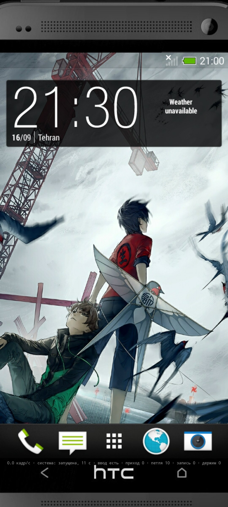

HTC One M7 Sense 5.5 Android 4.4.2 by ISTRATII_TECH (https://t.me/istratii_tech)

To launch, tap the HTC logo -> Start
To stop, tap the HTC logo -> Stop

If your device has low RAM or too many background processes running, the host OS will kill the firmware.
For example, my S8+ failed to boot due to insufficient RAM.
Use the HWUI and profile settings if it doesn't start.

Known issues & notes:
    Device compatibility: Tested with Galaxy S24 Ultra, HTC U12+
    App crashes: You might encounter a black screen in some built-in apps. If this happens, restart the specific app (not the entire system).
    Wallpapers: Wallpapers may occasionally disappear. If they do, restart the system.
    HTTPS & Certificates: Go to http://ca.m7/ to add certificates to third-party browsers (like Firefox). This is required for HTTPS to work, as a proxy layer is used to forward requests to the main system.
    File transfer: To add your own files to the ROM, transfer them to the HTC One M7 directory in the root of your SD card.
    File Explorer: You need to reopen ES File Explorer to refresh the file list inside the HTC One M7 folder.
    Keyboard: The keyboard may sometimes freeze or get stuck; use the reset button to fix it.
    System shutdown: When you stop the system, you must completely close (kill) the app before you can launch the system again.
    JavaScript: JavaScript might not work properly in some places, which could cause additional issues.
